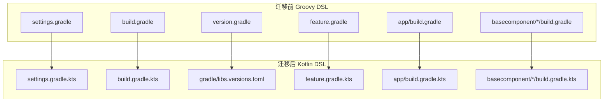
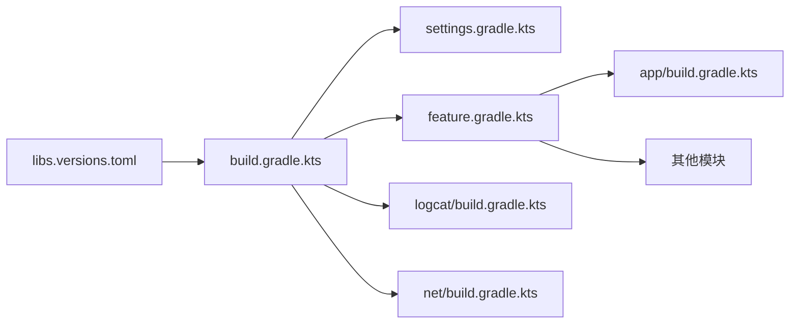

# Design Document: Gradle Kotlin DSL Migration

## Overview

本设计文档描述了将 Android MVVM Demo 项目的 Gradle 构建文件从 Groovy DSL 迁移到 Kotlin DSL (.kts) 的技术方案。迁移将采用渐进式策略，按照依赖关系顺序迁移各个文件，确保每一步都可验证。

### 迁移范围

需要迁移的文件清单：

| 文件路径 | 类型 | 复杂度 |
|---------|------|--------|
| settings.gradle | 设置文件 | 高 (含自定义函数) |
| build.gradle (根目录) | 根构建文件 | 中 |
| version.gradle | 共享脚本 | 低 (整合到版本目录) |
| feature.gradle | 共享脚本 | 中 |
| app/build.gradle | 应用模块 | 中 |
| basecomponent/logcat/build.gradle | 库模块 | 低 |
| basecomponent/net/build.gradle | 库模块 | 低 |

### 迁移策略

采用"自底向上"的迁移顺序：
1. 首先更新版本目录 (libs.versions.toml)
2. 迁移简单的库模块
3. 迁移共享脚本
4. 迁移根构建文件
5. 迁移 settings 文件
6. 迁移 app 模块

## Architecture



### 依赖关系图



## Components and Interfaces

### 1. 版本目录组件 (Version Catalog)

更新 `gradle/libs.versions.toml` 以整合 `version.gradle` 中的依赖定义。

```toml
[versions]
# 现有版本
agp = "8.10.0"
kotlin = "2.1.0"
hilt = "2.56.2"

# 从 version.gradle 迁移的版本
lifecycle = "2.8.7"
activityKtx = "1.10.1"
fragmentKtx = "1.5.2"
datastore = "1.0.0"
appcompat = "1.6.1"
coreKtx = "1.9.0"
recyclerview = "1.2.0"
material = "1.5.0"
constraintlayout = "2.0.4"
glide = "4.12.0"
arouter = "1.5.2"
gson = "2.9.0"
room = "2.4.2"

[libraries]
# AndroidX
appcompat = { group = "androidx.appcompat", name = "appcompat", version.ref = "appcompat" }
core-ktx = { group = "androidx.core", name = "core-ktx", version.ref = "coreKtx" }
activity-ktx = { group = "androidx.activity", name = "activity-ktx", version.ref = "activityKtx" }
fragment-ktx = { group = "androidx.fragment", name = "fragment-ktx", version.ref = "fragmentKtx" }

# Lifecycle
lifecycle-runtime-ktx = { group = "androidx.lifecycle", name = "lifecycle-runtime-ktx", version.ref = "lifecycle" }
lifecycle-viewmodel-ktx = { group = "androidx.lifecycle", name = "lifecycle-viewmodel-ktx", version.ref = "lifecycle" }
lifecycle-compiler = { group = "androidx.lifecycle", name = "lifecycle-compiler", version.ref = "lifecycle" }

# Hilt
hilt-android = { group = "com.google.dagger", name = "hilt-android", version.ref = "hilt" }
hilt-compiler = { group = "com.google.dagger", name = "hilt-android-compiler", version.ref = "hilt" }

# UI
recyclerview = { group = "androidx.recyclerview", name = "recyclerview", version.ref = "recyclerview" }
material = { group = "com.google.android.material", name = "material", version.ref = "material" }
constraintlayout = { group = "androidx.constraintlayout", name = "constraintlayout", version.ref = "constraintlayout" }

# Other
glide = { group = "com.github.bumptech.glide", name = "glide", version.ref = "glide" }
arouter-api = { group = "com.alibaba", name = "arouter-api", version.ref = "arouter" }
arouter-compiler = { group = "com.alibaba", name = "arouter-compiler", version.ref = "arouter" }
gson = { group = "com.google.code.gson", name = "gson", version.ref = "gson" }
datastore = { group = "androidx.datastore", name = "datastore-preferences", version.ref = "datastore" }
room-common = { group = "androidx.room", name = "room-common", version.ref = "room" }

[plugins]
android-application = { id = "com.android.application", version.ref = "agp" }
android-library = { id = "com.android.library", version.ref = "agp" }
kotlin-android = { id = "org.jetbrains.kotlin.android", version.ref = "kotlin" }
kotlin-kapt = { id = "org.jetbrains.kotlin.kapt", version.ref = "kotlin" }
hilt = { id = "com.google.dagger.hilt.android", version.ref = "hilt" }
```

### 2. 根构建文件组件 (Root Build File)

`build.gradle.kts` 转换示例：

```kotlin
// build.gradle.kts
buildscript {
    repositories {
        mavenLocal()
        google()
        mavenCentral()
        maven { url = uri("./router_gradle_plugin") }
        maven { url = uri("https://maven.aliyun.com/repository/public") }
        maven { url = uri("https://maven.aliyun.com/repository/google") }
        maven { url = uri("https://maven.aliyun.com/repository/central") }
        maven { url = uri("https://maven.aliyun.com/repository/gradle-plugin") }
        maven { url = uri("https://maven.aliyun.com/repository/jcenter") }
    }
    dependencies {
        classpath(libs.android.gradle.plugin)
        classpath(libs.kotlin.gradle.plugin)
        classpath(libs.hilt.gradle.plugin)
        classpath("org.jetbrains.kotlin:compose-compiler-gradle-plugin:2.1.0")
    }
}

subprojects {
    afterEvaluate {
        if (plugins.hasPlugin("com.android.application") ||
            plugins.hasPlugin("com.android.library")) {
            
            extensions.configure<com.android.build.gradle.BaseExtension> {
                buildFeatures.buildConfig = true
                
                compileOptions {
                    sourceCompatibility = JavaVersion.VERSION_17
                    targetCompatibility = JavaVersion.VERSION_17
                }
            }
            
            extensions.configure<org.jetbrains.kotlin.gradle.dsl.KotlinJvmOptions> {
                jvmTarget = "17"
            }
        }
    }
}

tasks.register<Delete>("clean") {
    delete(rootProject.buildDir)
}
```

### 3. Settings 文件组件 (Settings File)

`settings.gradle.kts` 转换，包含自定义函数：

```kotlin
// settings.gradle.kts
pluginManagement {
    repositories {
        maven { url = uri("https://maven.aliyun.com/repository/gradle-plugin") }
        maven { url = uri("https://maven.aliyun.com/repository/google") }
        maven { url = uri("https://maven.aliyun.com/repository/central") }
        gradlePluginPortal()
        google()
        mavenCentral()
        maven {
            url = uri("./router_gradle_plugin")
            name = "MavenRepo"
        }
    }
}

dependencyResolutionManagement {
    repositoriesMode.set(RepositoriesMode.PREFER_SETTINGS)
    repositories {
        maven { url = uri("https://maven.aliyun.com/repository/google") }
        maven { url = uri("https://maven.aliyun.com/repository/central") }
        maven { url = uri("https://maven.aliyun.com/repository/public") }
        maven { url = uri("https://maven.aliyun.com/repository/jcenter") }
        mavenLocal()
        google()
        mavenCentral()
        maven { url = uri("./router_gradle_plugin") }
    }
}

rootProject.name = "CA_demo"

// 模块包含
include(":app")
include(":lib_base_package")
include(":core:common")
include(":core:resource")
// ... 其他模块
```

### 4. 模块构建文件组件 (Module Build Files)

#### App 模块示例

```kotlin
// app/build.gradle.kts
plugins {
    id("com.android.application")
    id("org.jetbrains.kotlin.android")
    id("org.jetbrains.kotlin.kapt")
    id("dagger.hilt.android.plugin")
}

apply(from = "${project.rootDir}/lib_base_package/router.gradle")

android {
    compileSdk = 35
    namespace = "com.mvvm.demo"
    
    defaultConfig {
        applicationId = "com.mvvm.demo"
        minSdk = 23
        targetSdk = 34
        versionCode = 1
        versionName = "1.0"
        
        testInstrumentationRunner = "androidx.test.runner.AndroidJUnitRunner"
        
        javaCompileOptions {
            annotationProcessorOptions {
                arguments["room.schemaLocation"] = "$projectDir/schemas"
            }
        }
    }
    
    buildFeatures {
        dataBinding = true
    }
    
    buildTypes {
        release {
            isMinifyEnabled = false
            proguardFiles(
                getDefaultProguardFile("proguard-android-optimize.txt"),
                "proguard-rules.pro"
            )
        }
    }
    
    compileOptions {
        sourceCompatibility = JavaVersion.VERSION_17
        targetCompatibility = JavaVersion.VERSION_17
    }
    
    kotlinOptions {
        jvmTarget = "17"
    }
    
    packaging {
        resources {
            excludes += setOf(
                "META-INF/gradle/incremental.annotation.processors",
                "META-INF/library_release.kotlin_module",
                "META-INF/*.kotlin_module"
            )
        }
    }
}

kapt {
    arguments {
        arg("AROUTER_MODULE_NAME", project.name)
    }
}

dependencies {
    implementation(libs.activity.ktx)
    implementation(libs.fragment.ktx)
    implementation(libs.core.ktx)
    implementation(libs.appcompat)
    implementation(libs.glide)
    implementation(libs.material)
    
    implementation(project(":core:common"))
    implementation(project(":data:mine"))
    implementation(project(":basecomponent:logcat"))
    implementation(project(":basecomponent:net"))
    // ... 其他依赖
    
    implementation(libs.hilt.android)
    kapt(libs.hilt.compiler)
}
```

#### Library 模块示例

```kotlin
// basecomponent/logcat/build.gradle.kts
plugins {
    id("com.android.library")
    id("org.jetbrains.kotlin.android")
}

android {
    compileSdk = 31
    namespace = "com.mvvm.logcat"
    
    defaultConfig {
        minSdk = 23
        
        testInstrumentationRunner = "androidx.test.runner.AndroidJUnitRunner"
        consumerProguardFiles("consumer-rules.pro")
    }
    
    buildTypes {
        release {
            isMinifyEnabled = false
            proguardFiles(
                getDefaultProguardFile("proguard-android-optimize.txt"),
                "proguard-rules.pro"
            )
        }
    }
    
    compileOptions {
        sourceCompatibility = JavaVersion.VERSION_1_8
        targetCompatibility = JavaVersion.VERSION_1_8
    }
    
    kotlinOptions {
        jvmTarget = "1.8"
    }
}

dependencies {
    implementation("com.dianping.android.sdk:logan:1.2.4")
    implementation("com.elvishew:xlog:1.10.1")
    implementation(libs.appcompat)
}
```

## Data Models

### 语法转换映射表

| Groovy 语法 | Kotlin DSL 语法 | 示例 |
|------------|----------------|------|
| `'string'` | `"string"` | `id 'plugin'` → `id("plugin")` |
| `method arg` | `method(arg)` | `include ':app'` → `include(":app")` |
| `property value` | `property = value` | `compileSdk 35` → `compileSdk = 35` |
| `def var` | `val var` | `def name = "x"` → `val name = "x"` |
| `ext.prop` | `extra["prop"]` | `ext.kotlin_version` → `extra["kotlin_version"]` |
| `"$var"` | `"$var"` 或 `"${var}"` | 保持不变 |
| `project(':mod')` | `project(":mod")` | 括号和双引号 |
| `fileTree(dir: 'x')` | `fileTree("x")` | 简化语法 |
| `task name(type: T)` | `tasks.register<T>("name")` | 类型安全注册 |

### 特殊配置转换

#### BuildTypes 访问

```groovy
// Groovy
buildTypes {
    release {
        minifyEnabled false
    }
}

// Kotlin DSL
buildTypes {
    getByName("release") {
        isMinifyEnabled = false
    }
    // 或使用 named
    named("release") {
        isMinifyEnabled = false
    }
}
```

#### PackagingOptions 转换

```groovy
// Groovy
packagingOptions {
    exclude 'META-INF/*.kotlin_module'
}

// Kotlin DSL
packaging {
    resources {
        excludes += "META-INF/*.kotlin_module"
        // 或批量添加
        excludes += setOf(
            "META-INF/*.kotlin_module",
            "META-INF/LICENSE"
        )
    }
}
```

#### Kapt 配置转换

```groovy
// Groovy
kapt {
    arguments {
        arg("AROUTER_MODULE_NAME", project.getName())
    }
}

// Kotlin DSL
kapt {
    arguments {
        arg("AROUTER_MODULE_NAME", project.name)
    }
}
```

## Correctness Properties

*A property is a characteristic or behavior that should hold true across all valid executions of a system-essentially, a formal statement about what the system should do. Properties serve as the bridge between human-readable specifications and machine-verifiable correctness guarantees.*

基于 prework 分析，本迁移项目主要涉及文件转换和配置迁移，大部分验收标准是具体的示例验证而非通用属性。以下是可测试的属性：

### Property 1: 模块包含关系保持不变

*For any* 迁移前的 settings.gradle 中包含的模块列表，迁移后的 settings.gradle.kts 应该包含完全相同的模块集合。

**Validates: Requirements 2.6**

### Property 2: 构建成功性

*For any* 迁移后的 Gradle 配置，执行 `./gradlew clean assembleDebug` 应该成功完成，无编译错误。

**Validates: Requirements 7.1, 7.2, 7.3**

### Property 3: 依赖解析一致性

*For any* 迁移前项目中声明的依赖，迁移后应该能够正确解析到相同的依赖版本。

**Validates: Requirements 5.1, 5.3**

注意：由于本迁移任务主要是语法转换和文件重命名，大部分验收标准通过具体示例验证（构建成功即可），而非需要属性测试的通用规则。


## Error Handling

### 常见迁移错误及解决方案

| 错误类型 | 原因 | 解决方案 |
|---------|------|---------|
| `Unresolved reference` | Kotlin DSL 需要显式导入或类型声明 | 添加必要的 import 语句或使用完整类名 |
| `Type mismatch` | Groovy 动态类型 vs Kotlin 静态类型 | 添加显式类型转换或使用正确的 API |
| `Cannot access 'xxx'` | 属性访问方式不同 | 使用 getter 方法或 extensions.getByType() |
| `Script compilation error` | 语法不兼容 | 检查括号、引号、赋值语法 |
| `Plugin not found` | 插件 ID 格式错误 | 使用双引号和正确的插件 ID |

### 回滚策略

如果迁移导致构建失败且无法快速修复：

1. 保留原始 .gradle 文件的备份
2. 可以同时存在 .gradle 和 .gradle.kts 文件（Gradle 优先使用 .kts）
3. 删除 .kts 文件即可回滚到 Groovy 版本

## Testing Strategy

### 验证方法

由于这是构建配置迁移，主要通过以下方式验证：

1. **语法验证**: Gradle 同步成功（IDE 无红色错误）
2. **构建验证**: `./gradlew clean assembleDebug` 成功
3. **功能验证**: 应用可以正常安装和运行

### 分步验证计划

| 阶段 | 迁移内容 | 验证命令 |
|-----|---------|---------|
| 1 | 版本目录更新 | `./gradlew dependencies` |
| 2 | 库模块迁移 | `./gradlew :basecomponent:logcat:assemble` |
| 3 | 共享脚本迁移 | `./gradlew projects` |
| 4 | 根构建文件迁移 | `./gradlew clean` |
| 5 | Settings 文件迁移 | `./gradlew projects` |
| 6 | App 模块迁移 | `./gradlew :app:assembleDebug` |
| 7 | 完整构建 | `./gradlew assembleDebug` |

### 单元测试

对于本迁移任务，不需要编写代码单元测试。验证通过 Gradle 构建命令完成。

### 属性测试

由于迁移任务的特殊性（配置文件转换），属性测试不适用。主要依赖构建验证确保迁移正确性。
